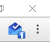

# Inbox checker and notifier

This simple and lightweight extension has a couple of features:

- Periodically check for new emails in background
- Opens (or focuses) inbox upon clicking the badge
- Display unread count in extension badge
- Display notifications for new emails
 - Notifications use gravatar.com for images

### Permissions explanation

| Permission | Explanation |
| ---------- | ----------- |
| [`alarms`](https://developer.chrome.com/apps/alarms) | Periodic timer fired to check for new emails |
| [`notifications`](https://developer.chrome.com/apps/notifications) | Create notifications for new emails |
| [`storage`](https://developer.chrome.com/apps/storage) | Used to store timestamp of latest email to prevent double notifications |
| [`tabs`](https://developer.chrome.com/extensions/tabs) | Used to find and create a new tab with inbox open |
| [`https://mail.google.com/mail/`](https://mail.google.com/mail/feed/atom) | Used to access your email feed |
| [`https://www.gravatar.com/avatar/`](https://www.gravatar.com/avatar/f9c6903a50d1d861a47a614862b00b89.png) | Used for avatar images in notifications |

Released under [CC0 1.0 Universal](LICENSE) license.
